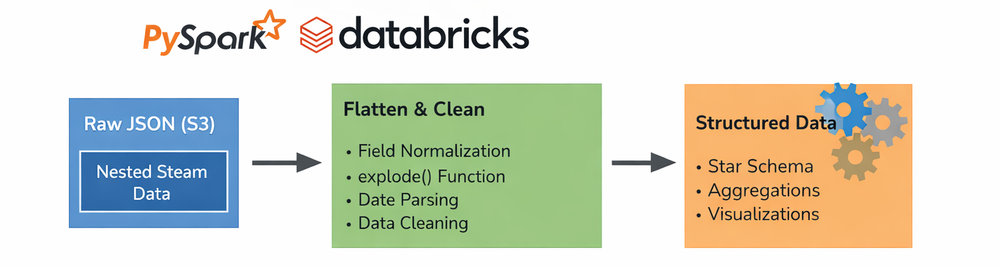
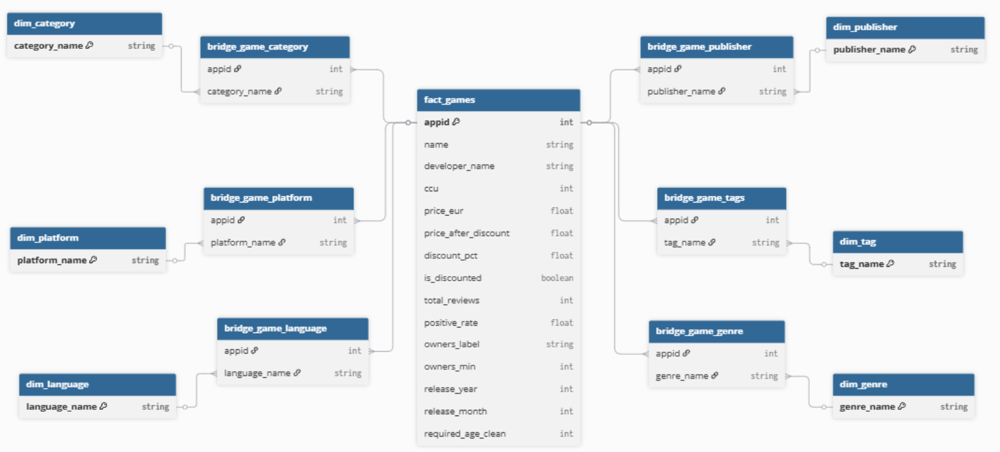
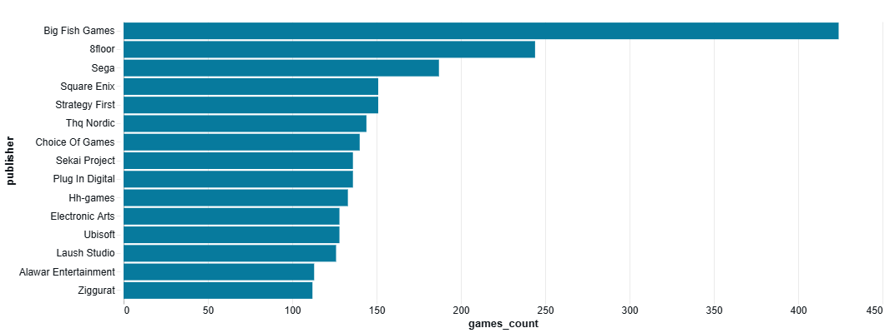
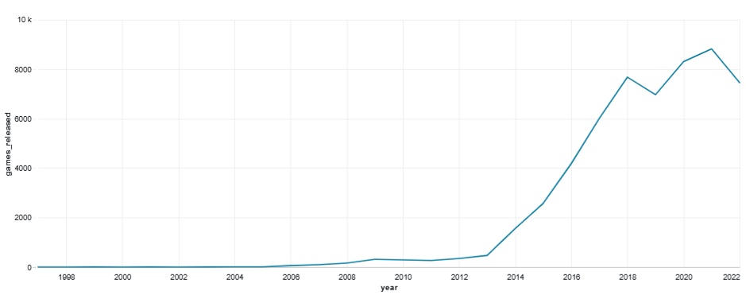
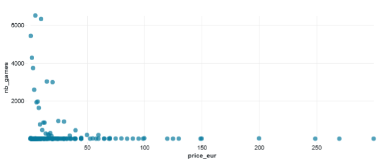
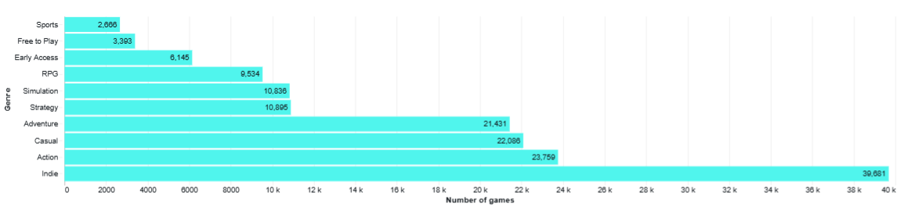
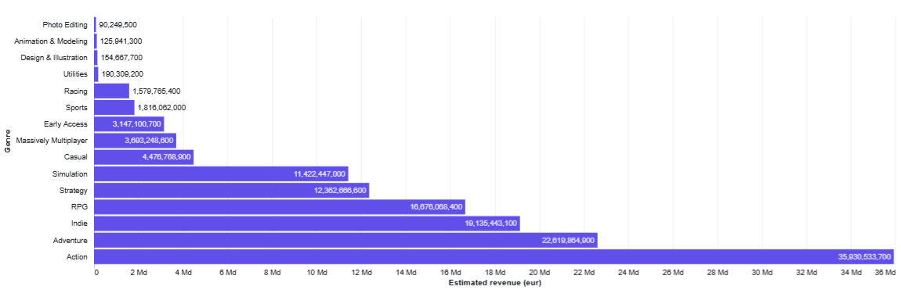

# Steam Market Analysis (PySpark)

Analysis of **Steam (a major PC gaming platform)** using **PySpark on Databricks**, focused on transforming semi-structured data and extracting market insights.

---

## Overview

This project explores the Steam game catalog to understand what drives game performance: genres, pricing, publishers, platforms, and player engagement.

The dataset comes as a **nested JSON file stored in a data lake**.

This type of structure is difficult to handle cleanly with Pandas. PySpark natively supports nested fields and arrays, which makes it well-suited for processing this dataset. Databricks provides a scalable environment to run these transformations efficiently.

---

## Data Processing Approach

The project follows a **layered transformation approach inspired by medallion architecture**:

- **Raw input (Bronze logic)**  
  Nested JSON data ingested from S3  

- **Transformation (Silver logic)**  
  Data flattened and cleaned using PySpark  
  - field normalization  
  - explode() on nested arrays  
  - date parsing  
  - data quality fixes  

- **Analytics layer (Gold logic)**  
  Structured dataset for analysis  
  - star schema logic  
  - aggregations  
  - visualizations  

👉 This logic is implemented within a **single PySpark workflow**, rather than persisted Bronze/Silver/Gold tables.

---

## What I did

- Explored a **deeply nested JSON schema**  
- Transformed data using **PySpark**  
- Built a **structured analytical dataset**  
- Answered business questions using aggregations  

---

## Data

- Source: Steam dataset (`steam_game_output.json`)  
- Format: nested JSON  
- ~55k games with embedded fields (genres, platforms, languages…)  
- Stored in an S3 data lake  

---

## Data Model

The analytical dataset is structured using a **star schema**:

- fact table: games  
- dimensions: genres, publishers, platforms, languages  
- bridge tables for many-to-many relationships  

---

## Key Insights

- The market has grown significantly over time  
- Publishers tend to specialize in specific genres  
- Action, Adventure, Indie, and RPG dominate revenue potential  
- English is present in most games  
- Windows is the dominant platform  

---

## Some of the visual analysis

### Top publishers

### Releases over time

### Price distribution

### Most represented genres

### Most profitable genres

---

## Interactive Notebook for full analysis

👉 https://huggingface.co/spaces/smargot/Steam  

*Note: Databricks outputs may display tables by default. Visualizations are available in the "Visualization 1" tabs.*

---

## Tech Stack

- Databricks  
- PySpark  
- AWS S3  

---

## Project Structure

- `data_processing.ipynb` → data transformation  
- `analysis.ipynb` → analysis & charts  
- `Visuals/` → exported images  

---

## Next Steps

Planned improvements to move toward a more production-ready setup:

- Implement a **fully persisted medallion architecture**  
  - Bronze: raw ingested data  
  - Silver: cleaned and normalized tables  
  - Gold: analytical / business-ready tables  

- Separate transformations into distinct pipelines  
- Store intermediate datasets instead of computing everything in one workflow  
